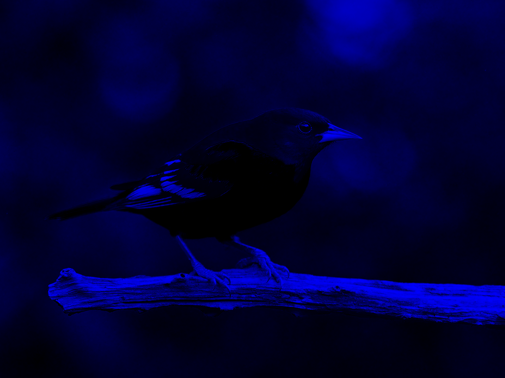
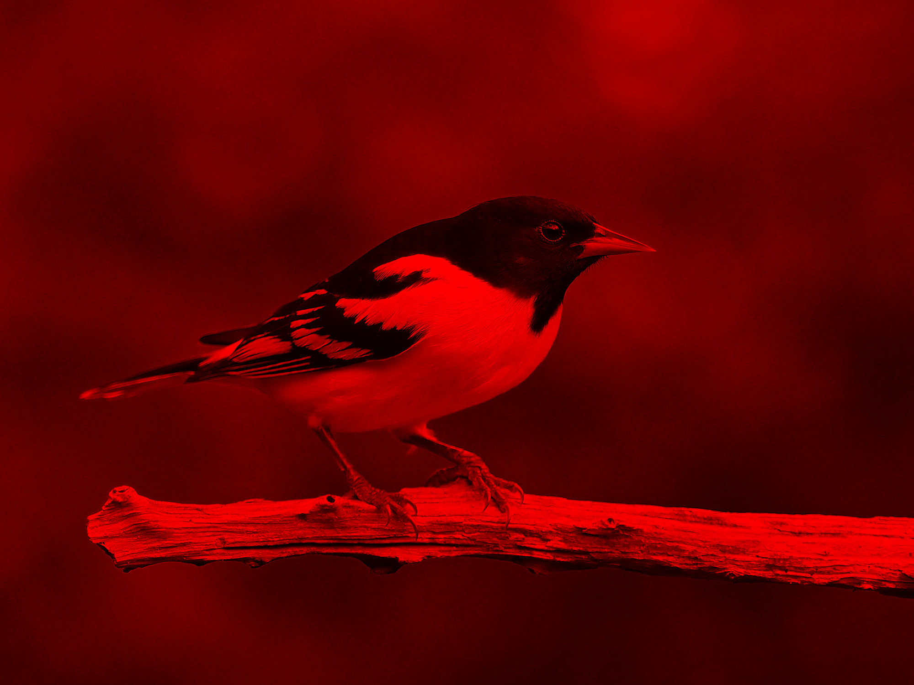
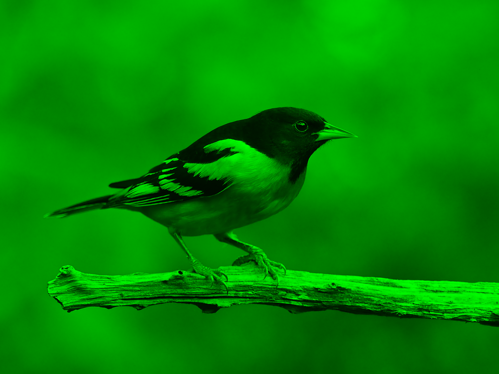
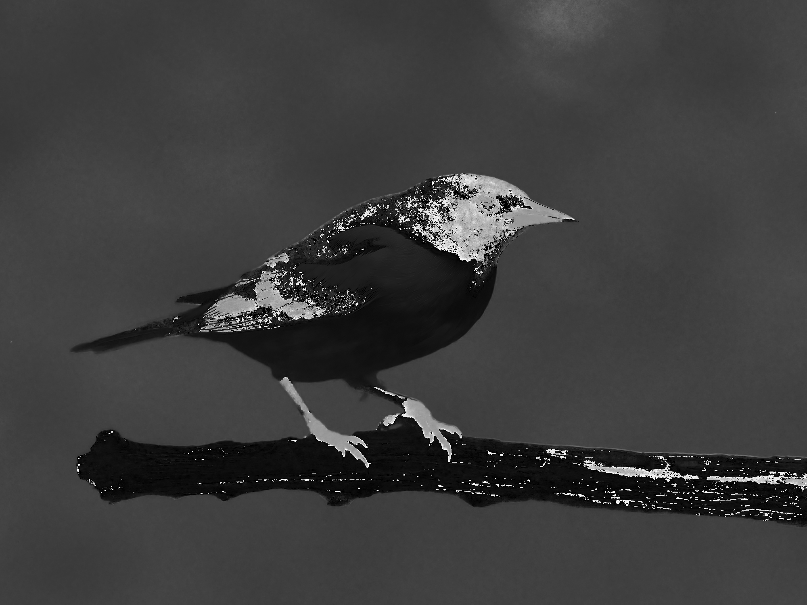
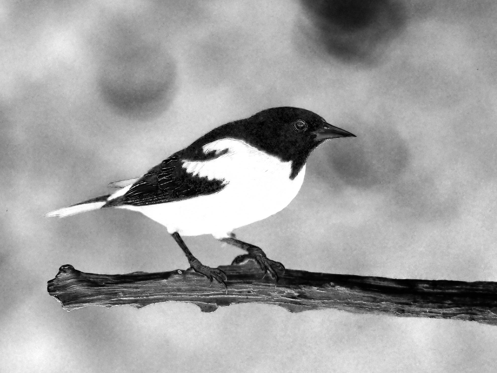
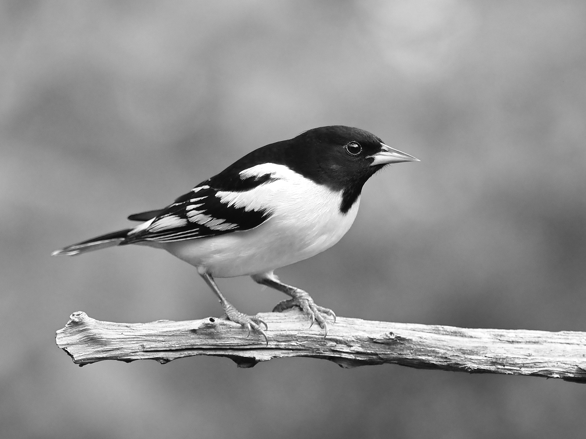
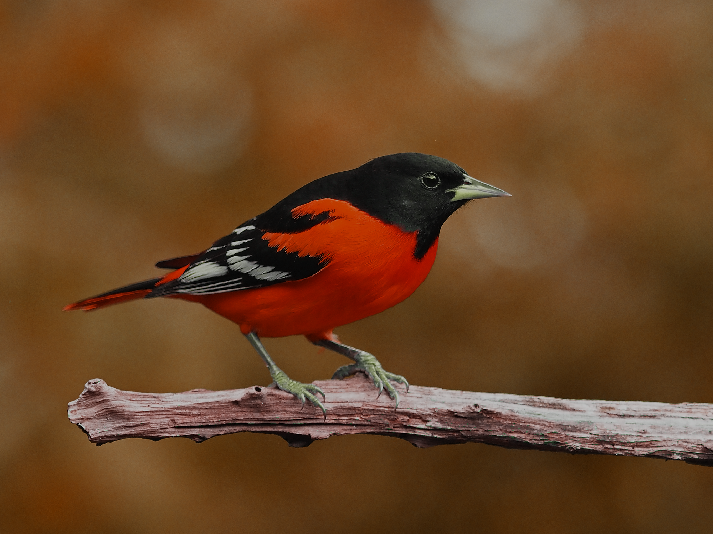
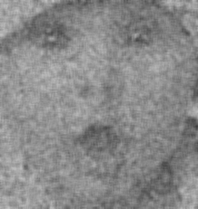
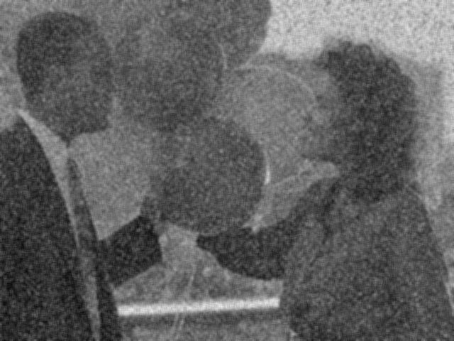
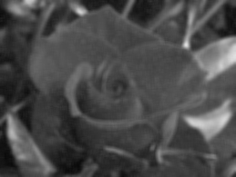

# Lab1
## Các bài thực hành trên lớp [lab1](./lab1.ipynb)
## Các bài tập thêm [excercise](./exercise.ipynb)
1. Viết chương trình nạp một ảnh và lưu thành 3 ảnh với 3 màu khác nhau
   ```python
    # Tạo một mảng NumPy rỗng có cùng kích thước và kiểu dữ liệu với ảnh gốc
    image = np.zeros_like(original_image)
    # Đỏ (0) - Xanh lá (1) - Xanh Dương (2)
    image[:, :, 0] = original_image[:, :, 0]
    ```
    output <br>
      

2. Viết chương trình nạp một ảnh và hoán đổi giá trị các màu. Lưu các ảnh vào máy
   ```python
    # 1: Hoán đổi kênh Đỏ và Xanh dương (RGB -> BGR)
    bgr_image = original_image[:, :, [2, 1, 0]]
    # 2: Hoán đổi kênh Đỏ và Xanh lá (RGB -> GRB)
    grb_image = original_image[:, :, [1, 0, 2]]
    # 3: Đảo ngược thứ tự kênh (RGB -> GBR)
    gbr_image = original_image[:, :, [1, 2, 0]]
   ```
   output<br>
    Xanh dương" width="200" />  Xanh lá" width="200" />  GBR" width="200" />
3. Viết chương trình nạp một ảnh, chuyển thành hệ màu HSV và lưu 3 ảnh với 3 màu khác nhau.
   ```python
    # Chuyển đổi ảnh từ hệ màu RGB sang HSV
    hsv_image = color.rgb2hsv(original_image_rgb)

    # Trích xuất từng kênh H, S, V
    hue_channel = hsv_image[:, :, 0]       # Kênh Hue (Sắc thái màu)
    saturation_channel = hsv_image[:, :, 1] # Kênh Saturation (Độ bão hòa màu)
    value_channel = hsv_image[:, :, 2]     # Kênh Value (Độ sáng/Giá trị)

    # Chuyển đổi các kênh về dạng uint8 [0-255] để lưu ảnh grayscale
    hue_display = (hue_channel * 255).astype(np.uint8)
    saturation_display = (saturation_channel * 255).astype(np.uint8)
    value_display = (value_channel * 255).astype(np.uint8)
   ```
   output<br>
     
4. Viết chương trình nạp một ảnh, chuyển sang hệ màu HSV. Lưu ảnh mới với kênh Hnew = 1/3 Hold, Vnew = 3/4 Vold.
   ```python
    # Chuyển đổi ảnh từ hệ màu RGB sang HSV
    hsv_image = color.rgb2hsv(original_image_rgb)

    # Trích xuất các kênh H, S, V
    hue_old = hsv_image[:, :, 0]
    saturation_old = hsv_image[:, :, 1]
    value_old = hsv_image[:, :, 2]

    # Tính toán các kênh H_new và V_new theo yêu cầu
    hue_new = hue_old / 3
    value_new = value_old * 3 / 4

    # Đảm bảo các giá trị vẫn nằm trong khoảng [0, 1] sau khi tính toán
    hue_new = np.clip(hue_new, 0, 1)
    value_new = np.clip(value_new, 0, 1)

    # Kết hợp các kênh mới thành ảnh HSV mới
    # Sử dụng np.stack để xếp chồng các kênh lại theo chiều mới (kênh màu)
    modified_hsv_image = np.stack([hue_new, saturation_old, value_new], axis=-1)

    # Chuyển đổi ảnh HSV mới trở lại hệ màu RGB
    # hsv2rgb trả về ảnh float với giá trị trong khoảng [0, 1]
    modified_rgb_image_float = color.hsv2rgb(modified_hsv_image)

    # Chuyển đổi ảnh RGB mới về dạng uint8 [0-255] để lưu và hiển thị
    modified_rgb_image_uint8 = (modified_rgb_image_float * 255).astype(np.uint8)
   ```
   output<br>
   
5. Viết chương trình sử dụng mean filter cho các hình trong thư mục Exercise.
   ```python
    # opening the image and converting it to grayscale
    baby = iio.imread('./exercise/baby.jpeg', mode='F')
    balloons_noisy = iio.imread('./exercise/balloons_noisy.png', mode='F')
    flower = iio.imread('./exercise/flower.jpeg', mode='F')

    # initializing the filter of size 5 by 5
    #the filter is divided by 25 for normalization
    k = np.ones((5,5))/25

    # performing convolution
    baby_mean_filter = sn.convolve(baby, k).astype(np.uint8)
    balloons_noisy_mean_filter = sn.convolve(balloons_noisy, k).astype(np.uint8)
    flower_mean_filter = sn.convolve(flower, k).astype(np.uint8)
   ```
   output<br>
     
