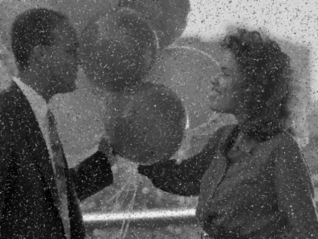
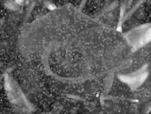
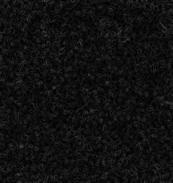
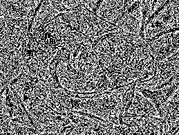
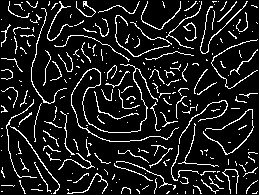
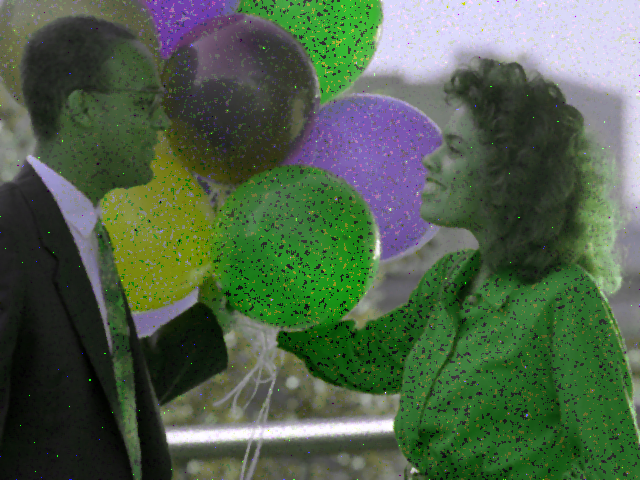
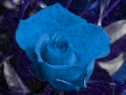

# Lab 2
## Code các bài tập [lab2](./lab2.ipynb)
6. Viết chương trình sử dụng các filter khử nhiễu đã thực hành cho các hình trong thư mục Exercise. Cho biết filter nào khử nhiễu tốt nhất?
    - mean filter
        ```python
        image_mean_filter = sn.convolve(original_image, np.ones((3,3))/9)
        ```
          
    - median filter
        ```python
        image_median_filter = sn.median_filter(original_image, size=3, footprint=None, output=None, mode='reflect', cval=0.0, origin=0)
        ```
          
    - maximum filter
        ```python
        image_max_filter = sn.maximum_filter(original_image, size=3, footprint=None, output=None, mode='reflect', cval=0.0, origin=0)
        ```
          
    - minimum filter
        ```python
        image_min_filter = sn.minimum_filter(original_image, size=3, footprint=None, output=None, mode='reflect', cval=0.0, origin=0)
        ```
          

7. Viết chương trình sử dụng các filter xác định biên của các hình trong thư mục Exercise. Lưu các hình vào máy. (Khử nhiễu trước khi xác định biên)
    ```python
    # Khử nhiễu
    image_median_filter = sn.median_filter(original_image, size=3, footprint=None, output=None, mode='reflect', cval=0.0, origin=0)
    ```
   - Sobel filter
        ```python
        image_sobel_filter = filters.sobel(image_median_filter).astype(np.uint8)
        ```
          
   - Prewitt filter
        ```python
        image_prewitt_filter = filters.prewitt(image_median_filter).astype(np.uint8)
        ```
          
   - Laplace filter
        ```python
        image_laplace_filter = filters.laplace(image_median_filter).astype(np.uint8)
        ```
          
   - Canny filter
        ```python
        image_canny_filter = (feature.canny(image_median_filter, sigma=3) * 255).astype(np.uint8)
        ```
          
8. Viết chương trình đổi màu RGB ngẫu nhiên của các hình trong thư mục Exercise. Lưu hình mới vào máy. (Khử nhiễu trước khi đổi màu)
    ```python
    # Khử nhiễu
    image_median_filter = sn.median_filter(original_image, size=3, footprint=None, output=None, mode='reflect', cval=0.0, origin=0)
    
    # Random color
    channel_permutation = random.sample([0, 1, 2], 3)
    random_rgb = image_median_filter[:, :, channel_permutation]
    
    # Lưu ảnh
    iio.imsave(image_name + '_random_rgb.png', random_rgb)
    ```
      
9.  Viết chương trình đổi màu HSV ngẫu nhiên nhưng không trùng của các hình trong thư mục Exercise. Lưu hình mới vào máy. (Khử nhiễu trước khi đổi màu)
    ```python
    # Chuyển đổi ảnh từ không gian màu RGB sang không gian màu HSV
    hsv_img = color.rgb2hsv(image_median_filter)

    # Tạo một giá trị ngẫu nhiên cho độ lệch màu sắc (hue shift) trong khoảng từ -0.5 đến 0.5
    hue_shift = random.uniform(-0.5, 0.5) 

    # Cập nhật kênh màu sắc (hue) của ảnh HSV bằng cách cộng giá trị hue_shift, sau đó sử dụng toán tử modulo 1.0 để đảm bảo giá trị nằm trong khoảng [0, 1)
    hsv_img[:, :, 0] = (hsv_img[:, :, 0] + hue_shift) % 1.0

    # Tạo một hệ số ngẫu nhiên cho độ bão hòa (saturation factor) trong khoảng từ 0.5 đến 1.5
    sat_factor = random.uniform(0.5, 1.5)

    # Cập nhật kênh độ bão hòa (saturation) của ảnh HSV bằng cách nhân với sat_factor, và sử dụng np.clip để đảm bảo giá trị nằm trong khoảng [0, 1]
    hsv_img[:, :, 1] = np.clip(hsv_img[:, :, 1] * sat_factor, 0, 1) 

    # Tạo một hệ số ngẫu nhiên cho độ sáng (value factor) trong khoảng từ 0.5 đến 1.5
    val_factor = random.uniform(0.5, 1.5)

    # Cập nhật kênh độ sáng (value) của ảnh HSV bằng cách nhân với val_factor,  và sử dụng np.clip để đảm bảo giá trị nằm trong khoảng [0, 1]
    hsv_img[:, :, 2] = np.clip(hsv_img[:, :, 2] * val_factor, 0, 1)

    # Chuyển đổi ảnh từ không gian màu HSV trở lại không gian màu RGB, nhân với 255 để đưa giá trị về khoảng [0, 255] và chuyển đổi kiểu dữ liệu thành uint8
    random_hsv_img = (color.hsv2rgb(hsv_img) * 255).astype(np.uint8)

    # Lưu ảnh
    iio.imsave(image_name + '_random_hsv.png', random_hsv_img)
    ```
      