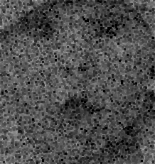

# Lab 2
## Code các bài tập [lab2](./lab2.ipynb)
6. Viết chương trình sử dụng các filter khử nhiễu đã thực hành cho các hình trong thư mục Exercise. Cho biết filter nào khử nhiễu tốt nhất?
    - mean filter
        ```python
        baby_mean_filter = sn.convolve(baby, k).astype(np.uint8)
        balloons_noisy_mean_filter = sn.convolve(balloons_noisy, k).astype(np.uint8)
        flower_mean_filter = sn.convolve(flower, k).astype(np.uint8)
        ```
          
    - median filter
        ```python
        baby_median_filter = sn.median_filter(baby, size=5, footprint=None, output=None, mode='reflect', cval=0.0, origin=0)
        balloons_noisy_median_filter = sn.median_filter(balloons_noisy, size=5, footprint=None, output=None, mode='reflect', cval=0.0, origin=0)
        flower_median_filter = sn.median_filter(flower, size=5, footprint=None, output=None, mode='reflect', cval=0.0, origin=0)
        ```
          
    - maximum filter
        ```python
        baby_maximum_filter = sn.maximum_filter(baby, size=5, footprint=None, output=None, mode='reflect', cval=0.0, origin=0)
        balloons_noisy_maximum_filter = sn.maximum_filter(balloons_noisy, size=5, footprint=None, output=None, mode='reflect', cval=0.0, origin=0)
        flower_maximum_filter = sn.maximum_filter(flower, size=5, footprint=None, output=None, mode='reflect', cval=0.0, origin=0)
        ```
          
    - minimum filter
        ```python
        baby_minimum_filter = sn.minimum_filter(baby, size=5, footprint=None, output=None, mode='reflect', cval=0.0, origin=0)
        balloons_noisy_minimum_filter = sn.minimum_filter(balloons_noisy, size=5, footprint=None, output=None, mode='reflect', cval=0.0, origin=0)
        flower_minimum_filter = sn.minimum_filter(flower, size=5, footprint=None, output=None, mode='reflect', cval=0.0, origin=0)
        ```
          

7. Viết chương trình sử dụng các filter xác định biên của các hình trong thư mục Exercise. Lưu các hình vào máy. (Khử nhiễu trước khi xác định biên)
8. Viết chương trình đổi màu RGB ngẫu nhiên của các hình trong thư mục Exercise. Lưu hình mới vào máy. (Khử nhiễu trước khi đổi màu)
9.  Viết chương trình đổi màu HSV ngẫu nhiên nhưng không trùng của các hình trong thư mục Exercise. Lưu hình mới vào máy. (Khử nhiễu trước khi đổi màu)